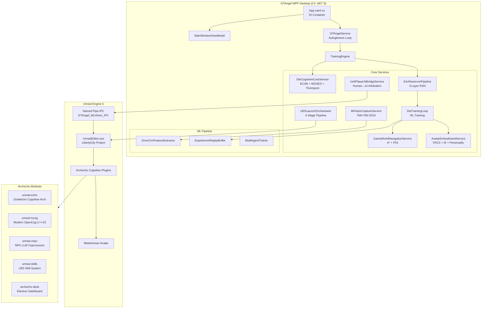
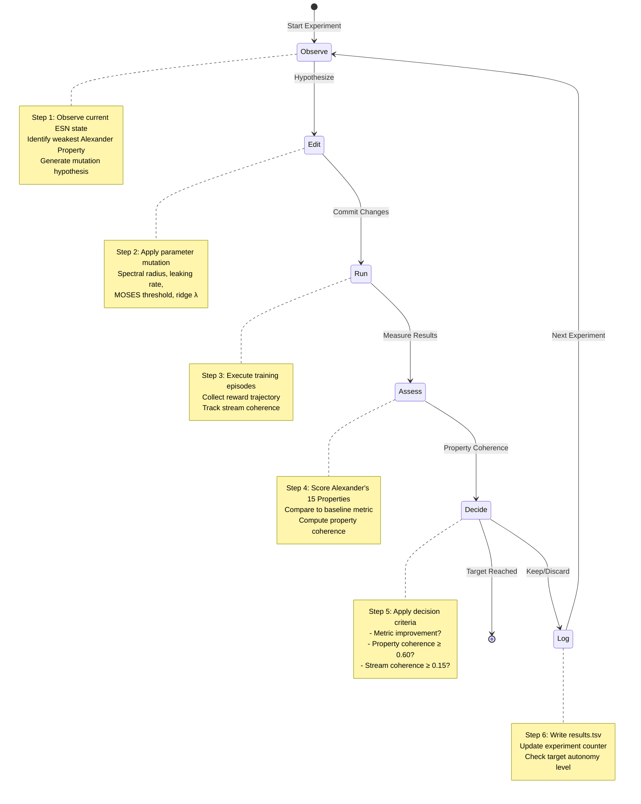
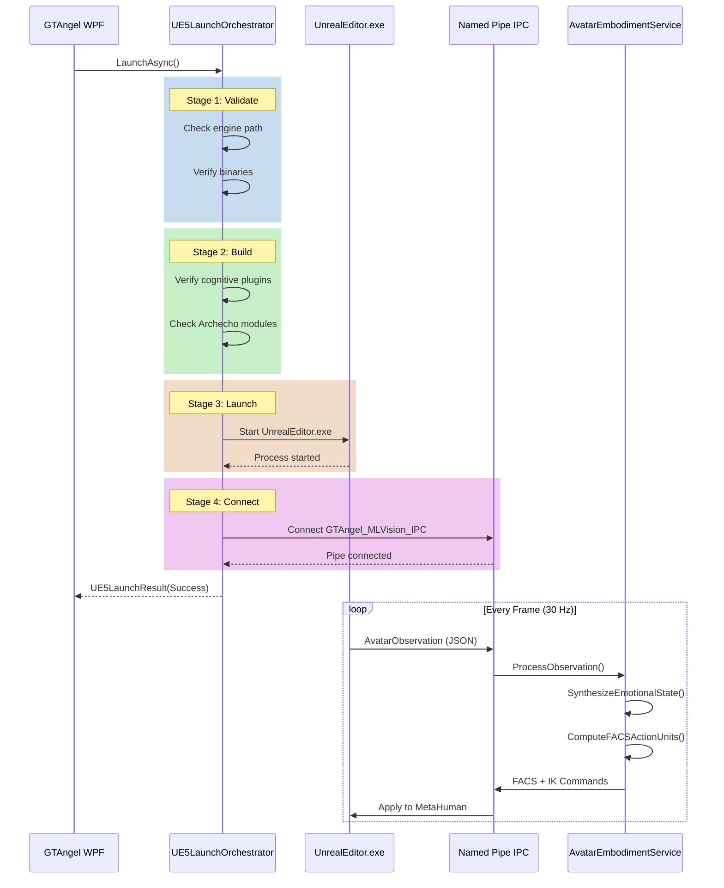

# GTAngel — Guardian Angel Cognitive AI Training Platform

<p align="center">
  
</p>

<p align="center">
  <strong>UE5 Cognitive AI Training Environment with Deep Tree Echo</strong><br/>
  A WPF desktop application implementing the DTE-KSM-Evo-Autogenesis framework for game-world cognitive architecture training.
</p>

<p align="center">
  
  
  
  
  
</p>

---

## Overview

GTAngel is a cognitive AI training platform that integrates GTA3 Definitive Edition game assets with the Deep Tree Echo (DTE) cognitive training framework. The system implements the DTE-KSM-Evo-Autogenesis evolution loop for game-world-based cognitive architecture training, evolving through Alexander's 15 Properties of Living Structure.

The platform bridges WPF desktop UI, Unreal Engine 5 cognitive plugins, and Echo State Network (ESN) reservoir computing to create a self-evolving AI training environment.

---

## Technical Architecture

### High-Level System Overview



### KSM Evolution Cycles Architecture

The system evolves through 6 KSM (Knowledge Sharing Mechanism) cycles, each strengthening specific Alexander Properties:

```mermaid
flowchart LR
    subgraph Cycle1["KSM Cycle 1"]
        C1[ML Vision Pipeline<br/>768×768]
        C1P["P5, P8, P13, P15"]
    end
    
    subgraph Cycle2["KSM Cycle 2"]
        C2[UE5 Build & Asset<br/>Integration]
        C2P["P2, P4, P8, P12, P14"]
    end
    
    subgraph Cycle3["KSM Cycle 3"]
        C3[UE5 Avatar<br/>Embodiment]
        C3P["P5, P8, P11, P12, P14"]
    end
    
    subgraph Cycle4["KSM Cycle 4"]
        C4[Game World<br/>Navigation]
        C4P["P1, P3, P6, P9, P10"]
    end
    
    subgraph Cycle5["KSM Cycle 5"]
        C5[DTE Cognitive<br/>Core]
        C5P["P2, P7, P8, P11, P14"]
    end
    
    subgraph Cycle6["KSM Cycle 6"]
        C6[UE5 Player↔AI<br/>Bridge]
        C6P["P4, P6, P8, P13, P15"]
    end
    
    Cycle1 --> Cycle2 --> Cycle3 --> Cycle4 --> Cycle5 --> Cycle6
```



### Deep Tree Echo ESN Architecture

```mermaid
flowchart TB
    subgraph Input["Input Layer"]
        Frame[ML Vision Frame<br/>768×768×3 = 1.77M floats]
        ONNX[ONNX CNN<br/>Feature Extractor]
        Features[Feature Vector<br/>512 dims]
    end
    
    subgraph ESN["Echo State Network Reservoir"]
        subgraph Sensory["Sensory Layer (128 neurons)"]
            S1[Cluster 0-3]
            S2[Cluster 4-7]
        end
        
        subgraph Cognitive["Cognitive Layer (256 neurons)"]
            C1[Cluster 0-7]
            C2[Cluster 8-15]
        end
        
        subgraph Executive["Executive Layer (512 neurons)"]
            E1[Cluster 0-7]
            E2[Cluster 8-15]
        end
    end
    
    subgraph Output["Output Layer"]
        Actions[Action Vector<br/>18 dims]
        Policy[Thompson Sampling<br/>Beta(α,β)]
        Controller[ViGEm Controller<br/>Output]
    end
    
    subgraph ECAN["ECAN Attention Economics"]
        STI[Short-Term Importance<br/>16 clusters]
        LTI[Long-Term Importance<br/>Hebbian decay]
        Budget[Attention Budget]
    end
    
    subgraph MOSES["MOSES Pattern Mining"]
        Patterns[Pattern Library<br/>256 max patterns]
        Jaccard[Jaccard Similarity<br/>0.55 threshold]
        Fitness[Pattern Fitness]
    end
    
    Frame --> ONNX --> Features
    Features --> Sensory
    Sensory --> Cognitive
    Cognitive --> Executive
    Executive --> Actions
    Actions --> Policy --> Controller
    
    ESN <--> ECAN
    ESN <--> MOSES
```

### Autogenesis Loop (6-Step Cycle)



### UE5 Integration Pipeline



### Autonomy Level Progression

```mermaid
gantt
    title Autonomy Level Evolution Targets
    dateFormat X
    axisFormat %s
    
    section Level 0: Reactive
    Stimulus-Response Only        :done, l0, 0, 1
    
    section Level 1: Adaptive
    Pattern Recognition           :done, l1, 1, 2
    Parameter Adaptation          :done, l1b, 1, 2
    
    section Level 2: Strategic
    Goal-Directed Planning        :active, l2, 2, 3
    Reward Shaping               :active, l2b, 2, 3
    
    section Level 3: Cognitive
    Self-Model                   :l3, 3, 4
    Meta-Cognition              :l3b, 3, 4
    
    section Level 4: Embodied
    4E Cognition Integration     :l4, 4, 5
    FACS + Personality          :l4b, 4, 5
    
    section Level 5: Autonomous
    Self-Modification           :l5, 5, 6
    Autogenesis                 :l5b, 5, 6
```



---

## Project Structure

```
GTAngel/
├── GTAngel/                          # Main WPF Application
│   ├── App.xaml.cs                   # DI container, service wiring
│   ├── Services/                     # Core services (40+ files)
│   │   ├── GTAngelService.cs         # Autogenesis loop controller
│   │   ├── DteCognitiveCoreService.cs # ECAN + MOSES + Thompson
│   │   ├── EsnReservoirPipeline.cs   # 3-layer ESN reservoir
│   │   ├── DteTrainingLoop.cs        # RL training loop
│   │   ├── AvatarEmbodimentService.cs # FACS + IK + Personality
│   │   ├── GameWorldNavigationService.cs # A* + POI navigation
│   │   ├── MlVisionCaptureService.cs # 768×768 DXGI capture
│   │   ├── UE5LaunchOrchestrator.cs  # 4-stage UE5 launch
│   │   ├── Ue5PlayerAiBridgeService.cs # Human↔AI arbitration
│   │   └── EmbodiedCognition/        # 4E cognition module
│   ├── Models/                       # Domain models
│   │   ├── TrainingModels.cs         # Episodes, experiments, properties
│   │   ├── EchoStateNetwork.cs       # ESN reservoir model
│   │   └── CognitiveState.cs         # 4E cognition state
│   ├── ViewModels/                   # MVVM ViewModels
│   │   ├── GTAngelViewModel.cs       # Main training dashboard
│   │   ├── AvatarViewModel.cs        # Avatar embodiment controls
│   │   └── GameRuntimeViewModel.cs   # Game runtime controls
│   ├── Views/                        # XAML views
│   │   ├── GTAngelView.xaml          # Training dashboard UI
│   │   ├── AvatarView.xaml           # Avatar controls UI
│   │   └── MainWindow.xaml           # Main application window
│   └── Interop/                      # UE5 IPC contracts
├── GTAngel.Tests/                    # Unit tests
├── Archecho/                         # UE5 AI training modules
│   ├── archecho-desk/                # Electron desktop dashboard
│   ├── unreal-echo/                  # Ontelecho cognitive architecture
│   ├── unreal-mcog/                  # Modern OpenCog (C++23)
│   ├── unreal-vnpu/                  # NPU LLM coprocessor
│   ├── unreal-skills/                # UE5 skill system
│   ├── unreal-gizmo/                 # UE5 editor gizmos
│   ├── unreal-msdk/                  # MetaHuman SDK integration
│   └── unreal-aiext/                 # AI extension plugins
├── docs/                             # Documentation
│   └── EMBODIED_COGNITION_UE5_SPEC.md # UE5 integration spec
├── Patterns.md                       # Winiwarter's 42 coordinates
└── GTAngel.sln                       # Visual Studio solution
```

---

## Technology Stack

| Component | Technology | Version |
|-----------|-----------|---------|
| **Framework** | .NET | 8.0 |
| **UI** | WPF | - |
| **MVVM** | CommunityToolkit.Mvvm | 8.2.2 |
| **Charts** | LiveChartsCore.SkiaSharpView.WPF | 2.0.0-rc4.5 |
| **Logging** | Serilog | 3.1.1 |
| **DI** | Microsoft.Extensions.DependencyInjection | 8.0.1 |
| **WebView** | Microsoft.Web.WebView2 | 1.0.2535.41 |
| **Database** | SQLite (sqlite-net-pcl) | 1.9.172 |
| **JSON** | System.Text.Json | 8.0.5 |
| **Game Engine** | Unreal Engine | 5.x |
| **Desktop Dashboard** | Electron | Latest |

---

## Implementation Status

### ✅ Completed Features

#### Core Infrastructure
- [x] .NET 8 WPF application with MVVM architecture
- [x] Dependency injection container with 40+ registered services
- [x] Serilog file logging with daily rolling
- [x] SQLite persistence layer
- [x] WebView2 browser integration

#### KSM Cycle 1: ML Vision Pipeline (768×768)
- [x] DXGI output duplication infrastructure
- [x] 768×768 staging texture frame buffer
- [x] Frame → float[] normalization pipeline
- [x] ONNX feature extractor integration point
- [x] Live frame-rate counter

#### KSM Cycle 2: UE5 Build & Asset Integration
- [x] 4-stage launch pipeline (Validate → Build → Launch → Connect)
- [x] Named pipe IPC (GTAngel_MLVision_IPC)
- [x] UE5 process lifecycle management
- [x] Granular progress events for UI updates

#### KSM Cycle 3: UE5 Avatar Embodiment
- [x] FACS Action Unit mapper (AU1..AU46)
- [x] EmotionalState synthesizer (ESN → FEmotionalState)
- [x] IK pose blend sender (ESN action → UE5 IK targets)
- [x] NeurochemicalSystem readback via IPC
- [x] SuperHotGirlPersonality trait applicator

#### KSM Cycle 4: Game World Navigation
- [x] A* pathfinding algorithm
- [x] POI (Point of Interest) curiosity system
- [x] District coverage tracking
- [x] Navigation reward integration

#### KSM Cycle 5: DTE Cognitive Core
- [x] ECAN Attention Economics (STI/LTI per neuron cluster)
- [x] MOSES Pattern Mining (sliding window + Jaccard similarity)
- [x] Ridge Regression Wout Trainer
- [x] Attention-Gated Action Logits
- [x] Thompson Sampling Policy (Beta distribution)
- [x] Cognitive telemetry events

#### KSM Cycle 6: UE5 Player↔AI Bridge
- [x] Input arbitration (Human vs AI)
- [x] Mode toggling (HumanOnly, AiOnly, Arbitrated)
- [x] Observation fusion
- [x] Episode boundary detection

#### Autogenesis Loop
- [x] 6-step cycle (Observe → Edit → Run → Assess → Decide → Log)
- [x] Alexander's 15 Properties scoring
- [x] Safety constraints (coherence halt, property degradation)
- [x] results.tsv experiment logging
- [x] Autonomy level tracking (0-5)

#### Archecho Modules
- [x] archecho-desk: Electron desktop dashboard
- [x] unreal-echo: Ontelecho cognitive architecture simulator
- [x] unreal-mcog: Modern OpenCog (C++23 reimplementation)
- [x] unreal-vnpu: NPU LLM coprocessor with GGUF support

### 🔄 In Progress

#### Phase 7: Embodied Cognition
- [x] SensoryPerceptionService (visual + auditory perception)
- [x] SpatialMemory with decay
- [x] ReactivePerceptionPolicy
- [x] MotorController for action execution
- [ ] Full policy integration with training loop

#### UE5 Plugin Development
- [ ] Complete Archecho plugin compilation for UE5.4
- [ ] MetaHuman DNA mapping pipeline
- [ ] Real-time FACS animation from ESN

### 📋 Next Steps (Planned)

#### Short-Term
1. **Real DXGI Capture**: Replace synthetic frame generation with actual desktop capture
2. **ONNX Model Loading**: Integrate trained CNN feature extractor
3. **UE5 Plugin Compilation**: Build and test Archecho plugins with UE5.4
4. **Multi-GPU Support**: CUDA/DirectML acceleration for ESN computation

#### Medium-Term
1. **Curriculum Learning**: Implement difficulty progression system
2. **Imitation Learning**: Train from human gameplay recordings
3. **LoRA Fine-Tuning**: Adapt NPU LLM for game-specific dialogue
4. **Cloud Training**: Distributed ESN training across multiple nodes

#### Long-Term
1. **Full Autogenesis**: Achieve Autonomy Level 5 (self-modification)
2. **Cross-Game Transfer**: Apply trained cognitive architecture to other games
3. **Real-Time Avatar**: Live MetaHuman facial animation from cognitive state
4. **Social Learning**: Multi-agent cooperative/competitive training

### 🚧 Still To Be Implemented

| Feature | Priority | Complexity | Dependencies |
|---------|----------|------------|--------------|
| Real DXGI frame capture | High | Medium | SharpDX/D3D11 |
| UE5 plugin build pipeline | High | High | UE5.4 SDK |
| ONNX runtime integration | Medium | Low | Microsoft.ML.OnnxRuntime |
| Curriculum difficulty API | Medium | Medium | TrainingEngine |
| Multi-agent coordination | Low | High | NetworkService |
| Cloud checkpoint sync | Low | Medium | Azure/AWS SDK |
| VR avatar embodiment | Future | Very High | OpenXR |

---

## Alexander's 15 Properties

The system evolves cognitive architecture using Christopher Alexander's 15 Properties of Living Structure as fitness criteria:

| # | Property | Description | Primary KSM Cycle |
|---|----------|-------------|-------------------|
| 0 | Levels of Scale | Hierarchical nesting of centers | Cycle 4 |
| 1 | Strong Centers | Distinct focal points | Cycle 2, 5 |
| 2 | Boundaries | Thick boundaries that unite/separate | Cycle 4 |
| 3 | Alternating Repetition | Rhythmic alternation | Cycle 4 |
| 4 | Positive Space | Every part positively shaped | Cycle 2, 6 |
| 5 | Good Shape | Clear, definite shapes | Cycle 1, 3 |
| 6 | Local Symmetries | Local, not global symmetry | Cycle 4, 6 |
| 7 | Deep Interlock | Centers hook into each other | Cycle 5 |
| 8 | Contrast | Unity through contrast | Cycle 1-6 |
| 9 | Gradients | Gradual transitions | Cycle 4 |
| 10 | Roughness | Irregularity that gives life | Cycle 4 |
| 11 | Echoes | Deep similarities | Cycle 3, 5 |
| 12 | The Void | Empty calm at center | Cycle 2, 3 |
| 13 | Simplicity | Geometric simplicity | Cycle 1, 6 |
| 14 | Not-Separateness | Connected to the world | Cycle 2, 3, 5 |

---

## Getting Started

### Prerequisites

- Windows 10/11 (64-bit)
- .NET 8.0 SDK
- Visual Studio 2022 (recommended) or VS Code
- Unreal Engine 5.4 (for UE5 integration)
- Node.js 18+ (for archecho-desk)

### Building

```powershell
# Clone the repository
git clone https://github.com/ReZorg/GTAngel.git
cd GTAngel

# Build the solution
dotnet build GTAngel.sln

# Run the application
dotnet run --project GTAngel/GTAngel.csproj
```

### Running the Electron Dashboard

```bash
cd Archecho/archecho-desk
npm install
npm start
```

---

## Configuration

Edit `GTAngel/appsettings.json`:

```json
{
  "App": {
    "Name": "GTA III - Definitive Edition",
    "Version": "1.84.3"
  },
  "UE4": {
    "ProjectName": "LibertyCity",
    "SupportsVulkan": true
  },
  "Logging": {
    "LogLevel": {
      "Default": "Information"
    }
  }
}
```

---

## License

Copyright © ReZorg 2026. All rights reserved.

---

## Contributing

This is a proprietary project. Please contact the maintainers for contribution guidelines.

---

## Acknowledgments

- **Deep Tree Echo**: Reservoir computing framework
- **Christopher Alexander**: 15 Properties of Living Structure
- **OpenCog Foundation**: Cognitive architecture patterns
- **Rockstar Games**: GTA3 Definitive Edition assets
- **Epic Games**: Unreal Engine 5
