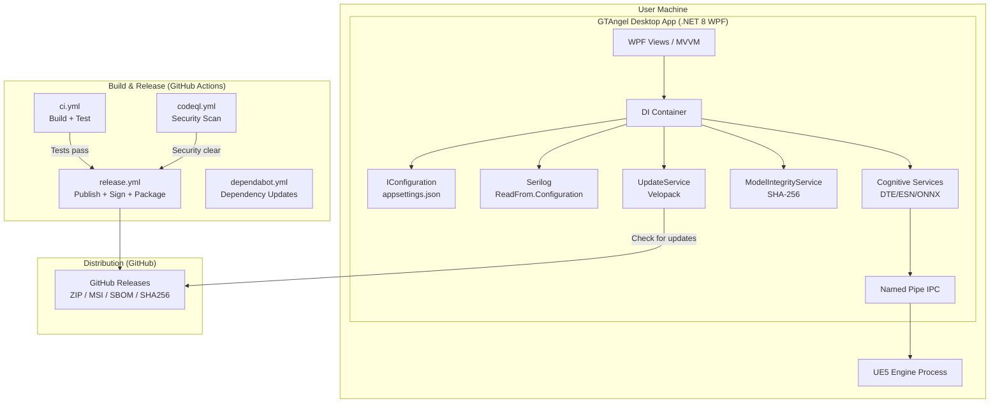
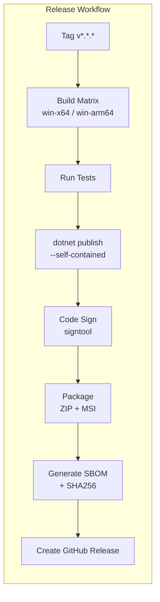
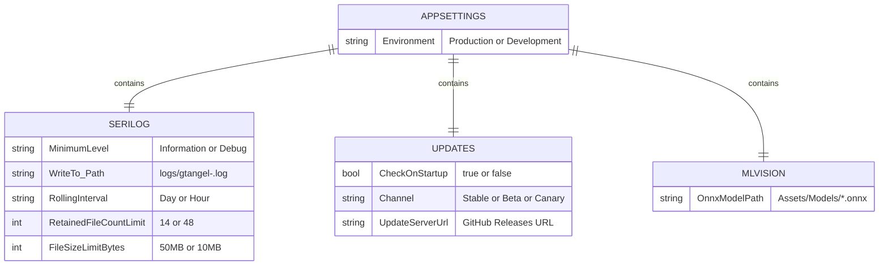

# GTAngel Desktop App Production Deployment - Implementation Plan

## Goal

Transition GTAngel from a development-only WPF application to a production-ready, deployable Windows desktop application. This encompasses self-contained .NET 8 publishing, automated CI/CD release pipelines, MSI installer creation, code signing infrastructure, auto-update mechanisms, security scanning, and comprehensive user documentation -- enabling end-users to install, run, and receive updates seamlessly.

## Requirements

- Self-contained .NET 8 publish configurations for win-x64 and win-arm64
- Automated GitHub Actions release workflow triggered by version tags
- WiX v5 MSI installer with Start Menu/Desktop shortcuts and upgrade support
- Portable (framework-dependent) distribution option
- Environment-specific configuration (Development vs Production)
- Serilog logging driven by appsettings.json (not hardcoded)
- CodeQL security scanning on every PR/push
- Roslyn static analyzers with .editorconfig severity rules
- Code signing scaffold for Windows SmartScreen trust
- Auto-update service (Velopack) checking GitHub Releases
- ONNX model integrity verification (SHA-256 checksums)
- SBOM generation (CycloneDX) attached to releases
- Post-publish asset validation (fail-fast on missing critical files)
- User documentation: installation, getting-started, troubleshooting

## Technical Considerations

### System Architecture Overview

### Technology Stack Selection

| Layer | Choice | Rationale |
|-------|--------|-----------|
| Runtime | .NET 8 Self-Contained | No user prerequisite; single-file deployment |
| UI | WPF + CommunityToolkit.Mvvm | Existing stack; rich Windows desktop UX |
| Logging | Serilog + Settings.Configuration | Config-driven, environment-aware, file rotation |
| Updates | Velopack | Modern Squirrel fork; delta updates; GitHub Releases source |
| Installer | WiX Toolset v5 | Enterprise MSI; per-user install; upgrade support |
| Security Scan | CodeQL + Roslyn Analyzers | Compile-time + CI-time vulnerability detection |
| Signing | signtool + Azure Key Vault | SmartScreen trust; timestamped signatures |
| SBOM | CycloneDX | Industry-standard; JSON format; CI-generated |
| CI/CD | GitHub Actions | Integrated with repo; matrix builds; artifact uploads |

### Integration Points

| Integration | Protocol | Direction |
|-------------|----------|-----------|
| UE5 Engine | Named Pipe IPC | Bidirectional |
| GitHub Releases | HTTPS REST | App to GitHub (update check) |
| Code Signing | signtool CLI | CI to Azure Key Vault |
| ONNX Models | File system | Local read + SHA-256 verify |
| Serilog | File sink | Write to logs/ directory |

### Deployment Architecture

### Configuration Schema

### Service API Design

No server-side API -- this is a desktop application. The internal service layer:

| Service | Responsibility | Interface |
|---------|---------------|-----------|
| `UpdateService` | Check/download/apply updates | `CheckForUpdatesAsync()`, `DownloadAndApplyAsync()` |
| `ModelIntegrityService` | Validate ONNX model hashes | `ValidateAllAsync()`, `GenerateChecksumsAsync()` |
| `AppConfiguration` | Load/save user settings | `LoadAsync()`, `Ue5EnginePath` |

### Security & Performance

| Concern | Mitigation |
|---------|-----------|
| Tampered models | SHA-256 checksums validated at startup |
| Supply chain | Dependabot + CycloneDX SBOM |
| Code vulnerabilities | CodeQL (CI) + Roslyn Analyzers (compile) |
| SmartScreen blocking | Code signing with timestamped cert |
| Secret leakage | GitHub Secrets; never in source |
| Log file growth | Size-based rotation + retention limits |
| Startup performance | PublishReadyToRun; fire-and-forget update check |

---

## Implementation Status

All items from this plan have been implemented and merged via PR #23:

| Phase | Status | Key Files |
|-------|--------|-----------|
| Build & Packaging | Done | `GTAngel.csproj`, publish profiles |
| CI/CD Pipeline | Done | `ci.yml`, `release.yml` |
| Installer | Done | `GTAngel.Installer/Product.wxs` |
| Configuration | Done | `appsettings.*.json`, `App.xaml.cs` |
| Security Scanning | Done | `codeql.yml`, `.editorconfig`, analyzers |
| Auto-Updates | Done (scaffold) | `UpdateService.cs` |
| Model Integrity | Done | `ModelIntegrityService.cs`, `checksums.json` |
| Code Signing | Done (scaffold) | `release.yml` signing step |
| SBOM | Done | `release.yml` CycloneDX step |
| Documentation | Done | `docs/user-guide/`, `docs/release/` |

## File Changes Summary

| File | Action | Purpose |
|------|--------|---------|
| `GTAngel/GTAngel.csproj` | Modified | Publish settings, analyzers, Velopack, validation target |
| `GTAngel/App.xaml.cs` | Modified | Config-based Serilog, UpdateService, ModelIntegrity init |
| `GTAngel/appsettings.Production.json` | Modified | Serilog configuration section |
| `GTAngel/appsettings.Development.json` | Modified | Serilog configuration section |
| `GTAngel/Services/UpdateService.cs` | Created | Auto-update via Velopack/GitHub Releases |
| `GTAngel/Services/ModelIntegrityService.cs` | Created | SHA-256 ONNX model verification |
| `GTAngel/Assets/Models/checksums.json` | Created | Model hash manifest |
| `GTAngel/Properties/PublishProfiles/*.pubxml` | Created | win-x64, win-arm64, Portable profiles |
| `.github/workflows/release.yml` | Created | Tag-triggered release with signing + SBOM |
| `.github/workflows/codeql.yml` | Created | Security scanning |
| `.github/dependabot.yml` | Created | Dependency vulnerability monitoring |
| `.editorconfig` | Created | Analyzer severity rules |
| `GTAngel.Installer/Product.wxs` | Created | WiX MSI installer definition |
| `docs/user-guide/` | Created | Installation, getting-started, troubleshooting |
| `docs/release/` | Created | Release process, system requirements |
| `CHANGELOG.md` | Modified | Updated with all additions |